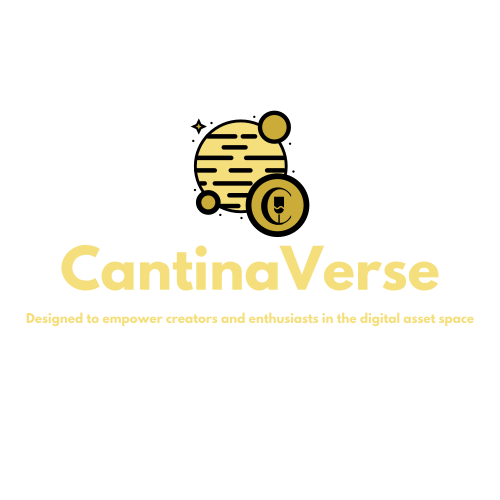

# CantinaVerse

- [CantinaVerse](#cantinaverse)
  - [Overview](#overview)
  - [About](#about)
    - [Key Benefits:](#key-benefits)
  - [New Features](#new-features)
    - [ERC20 Token Creation](#erc20-token-creation)
    - [Casino Games/Gaming](#casino-gamesgaming)
    - [Governance (DAOs)](#governance-daos)
  - [Roadmap](#roadmap)
  - [Challenge](#challenge)
  - [Solution](#solution)
  - [Why it Matters](#why-it-matters)
    - [Examples](#examples)
  - [Getting Started](#getting-started)
    - [Requirements](#requirements)
    - [Links](#links)

## Overview

Welcome to CantinaVerse, a visionary blockchain ecosystem designed to redefine the digital asset landscape. Built on the cutting-edge Superchain, CantinaVerse integrates a robust NFT marketplace with advanced features like ERC20 token creation, immersive casino games, and a governance framework (DAOs), all under one roof. Our mission is to empower creators, gamers, and investors with unparalleled opportunities for expression, engagement, and financial empowerment.

## About

CantinaVerse is meticulously crafted to serve a broad spectrum of users, offering a seamless blend of creativity, technology, and financial empowerment. Anchored on the robust Superchain infrastructure, our platform fosters a vibrant community where innovation and mutual benefit thrive.

### Key Benefits:

- **Diverse Ecosystem**: Catering to NFT collectors, ERC20 token creators, gamers, and governance enthusiasts, CantinaVerse ensures there's something for everyone, fostering a rich, dynamic environment.
  
- **User-Friendly Interface**: Designed with simplicity and accessibility in mind, CantinaVerse streamlines the processes for buying, selling, auctioning NFTs, creating ERC20 tokens, participating in gaming, and contributing to governance.
  
- **Secure Transactions**: Leveraging advanced blockchain technology, CantinaVerse guarantees secure, verifiable, and immutable transactions, laying a solid foundation of trust.
  
- **Community Engagement**: CantinaVerse prioritizes fostering a vibrant, engaged community through interactive gaming, participatory governance, and shared economic opportunities.

## New Features

With the introduction of ERC20 token creation, casino games/gaming, and governance (DAOs), CantinaVerse is poised to offer a comprehensive blockchain ecosystem. Each feature is designed to enhance user engagement and open up new avenues for growth and success.

### ERC20 Token Creation

Develop a user-friendly interface for creating ERC20 tokens, including options for setting token parameters and automatic liquidity pooling upon reaching thresholds.

### Casino Games/Gaming

Partner with game developers to integrate a variety of games, ensuring compatibility with the blockchain and allowing users to stake, bet, and win using the platform's native token.

### Governance (DAOs)

Decide on the governance model and explore creative uses for governance, such as community voting on new game integrations or platform upgrades.

## Roadmap

Our roadmap outlines the strategic plan for CantinaVerse's evolution, detailing upcoming features and improvements aimed at enhancing user experience and expanding our ecosystem.

## Challenge

Standing out in the fast-paced blockchain space requires more than innovative features; it demands a deep understanding of user needs, a focus on quality and security, and a commitment to community engagement.

## Solution

CantinaVerse addresses these challenges by offering a comprehensive ecosystem that caters to a wide range of interests and expertise, prioritizing user experience, enhancing security measures, and actively engaging with our community.

## Why it Matters

CantinaVerse democratizes access to blockchain technology, making it accessible and rewarding for users of all backgrounds. By empowering individuals to express themselves creatively, invest wisely, and engage meaningfully with a global community, we pave the way for a more equitable and innovative digital economy.

### Examples

- **NFT Success Stories**: CantinaVerse has facilitated numerous successful NFT sales and auctions, showcasing the power of blockchain in connecting creators with collectors.
  
- **ERC20 Innovation**: Our platform has served as a launching pad for innovative ERC20 tokens, driving new investment opportunities and contributing to the vibrancy of the DeFi ecosystem.
  
- **Community Impact**: Through interactive gaming and participatory governance, CantinaVerse has cultivated a tight-knit community that actively contributes to the platform's growth and success.

## Getting Started

### Requirements

- Basic knowledge of blockchain technology and cryptocurrencies.
- Access to a web-enabled device.
- A wallet compatible with the Superchain (e.g., MetaMask).

### Links

1. Visit [CantinaVerse](https://cantinaverse.tech) and sign up for an account.
2. Follow us on [Twitter](https://twitter.com/cantinaverse) for updates and community engagement.
3. Start exploring our features by navigating through the platform's intuitive interface.

Join us in shaping the future of blockchain ecosystems. Together, we're building CantinaVerse into a beacon of innovation and community in the digital asset space.
